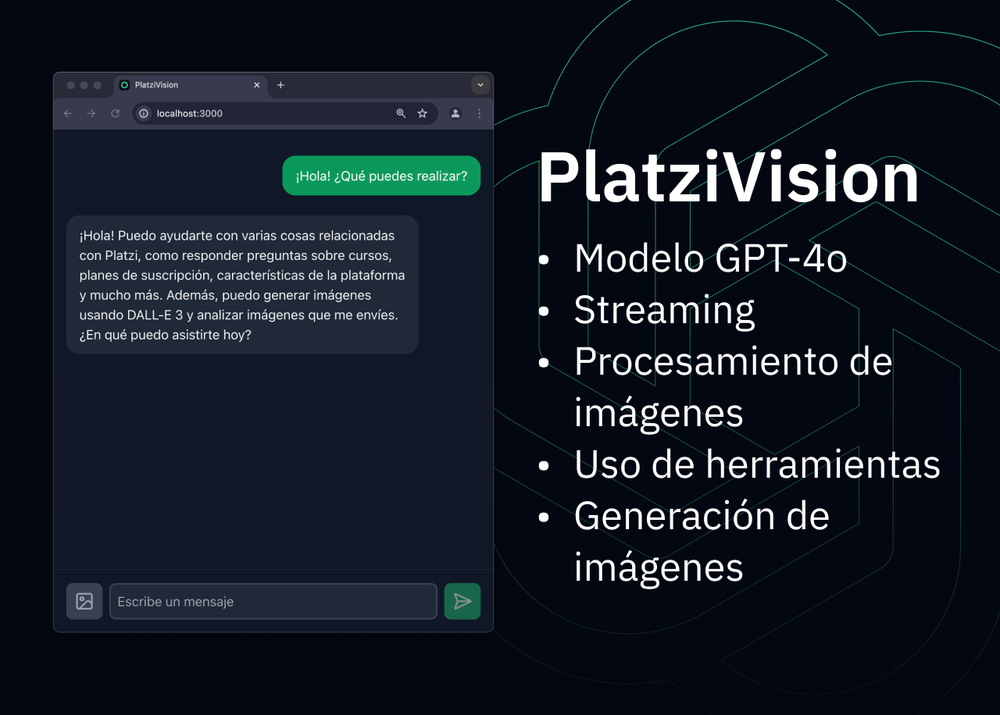
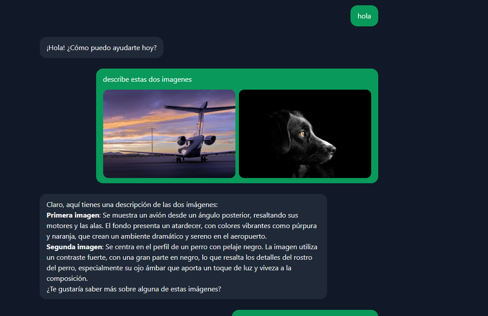

<h1 align="center">💡 PlatziVision 💻</h1>

<p align="center">
  PlatziVision es un chatbot que puede responder preguntas en tiempo real, analizar múltiples imágenes y generar imágenes utilizando DALL·E 3 esta desarrollado basado en el contenido
  del repositorio  https://github.com/platzi/platzivision.git como fuente de estudio.
</p>



## 🚀 Instalación

1. Clona el repositorio Original

```bash
git clone https://github.com/platzi/platzivision.git
```

2. Instala las dependencias de la interfaz web e inicia el servidor

Empieza desde la carpeta `platzi-vision-ui`

```bash
cd platzi-vision-ui
npm install
npm run dev
```

3. Crea el entorno virtual para la API

Empieza desde la carpeta `platzi-vision-api`

```bash
cd platzi-vision-api
python -m venv env
source env/bin/activate
```

4. Instala las dependencias de la API

En este repositorio se uso la librería OpenAI en su versión 1.55.3.

```bash
pip install -r requirements.txt
```

5. Inicia el servidor de la API

```bash
python app.py
```

¡Listo! Ahora tenemos el servidor web corriendo en http://localhost:3000 y el servidor de la API en http://127.0.0.1:5000.


## 📚 Estructura del proyecto

PlatziVision se compone de 2 partes: una interfaz web y una API. La interfaz web es una aplicación web basada en Next.js que nos permite interactuar con el chatbot. La API es un servidor en Flask que se encarga de procesar las solicitudes de la interfaz web y de interactuar con la librería de OpenAI para las siguientes funcionalidades:

- Respuesta a preguntas en tiempo real (vía streaming)
- Procesamiento de múltiples imágenes
- Generación de imágenes


## Ejemplo implementando la lectura de imagenes en el chat
